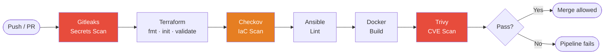
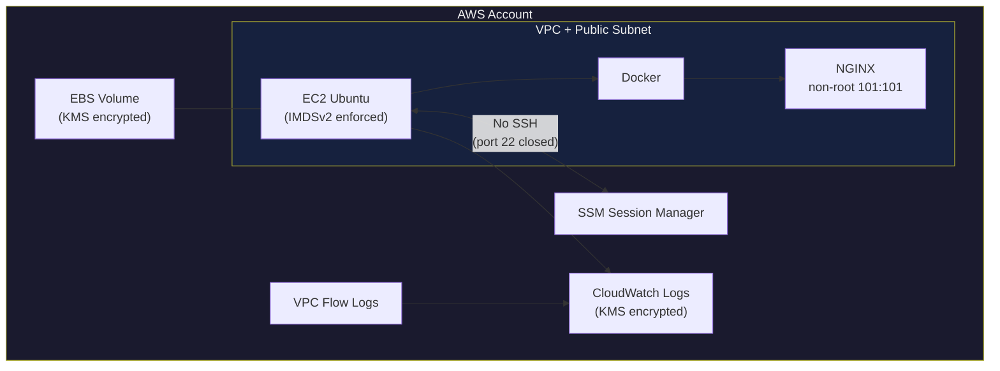

# Architecture Overview

This project demonstrates a security-first DevSecOps reference architecture for AWS.

## Pipeline Flow

## AWS Deployment

## Scope

- Provision cloud infrastructure with Terraform
- Harden hosts and deploy runtime with Ansible
- Build and run a hardened NGINX container with Docker
- Enforce automated checks in GitHub Actions
- Scan container vulnerabilities with Trivy

## Logical Flow

1. Terraform provisions AWS baseline resources (VPC, subnet, EC2, SG, KMS, CloudWatch).
2. Ansible configures Docker, applies host hardening, and deploys NGINX container.
3. CI pipeline validates Terraform, lints Ansible, builds Docker image, and runs Trivy scan.

## Security-by-Design Controls

- IAM least privilege roles for EC2 and logging
- IMDSv2 required on EC2 instance
- Encrypted EBS and CloudWatch logs with KMS CMK
- VPC flow logs for network observability
- Non-root container runtime for NGINX
- Fail-on-severity policy in vulnerability scan

## Deployment Model

- Single-account reference deployment
- Public subnet demo footprint for portfolio simplicity
- Production extension path:
  - private subnets
  - NAT egress controls
  - WAF/TLS ingress
  - remote Terraform state with locking
